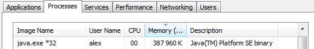

### A "java-malloc" implementation using java.nio.ByteBuffer to store object outside of java's heap (and garbage collection)

**Warning** do not run JmallocFloodTest blindly... Instead, use your favorite java profiler app (visualvm, etc.) to inspect the
behavior of the java process and allocated memory. FYI, it can crash your computer.

After a few iterations of the JmallocFloodTest, the java memory footprint is significant, but the heap is at a conservative low.
 

